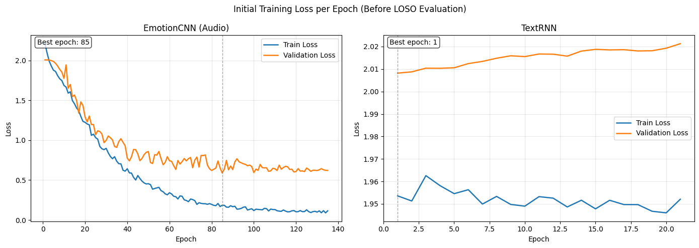
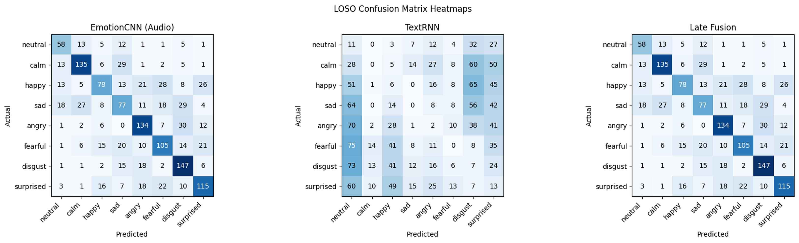

# Technical Report: Multimodal Emotion Recognition on RAVDESS

## 1. Objective

This report summarizes the model design, training behavior, and evaluation results from [Emotion_Recognition.ipynb](./Emotion_Recognition.ipynb). This notebook builds and evaluates three emotion-recognition models on the RAVDESS speech dataset:

1. `EmotionCNN (Audio)`
2. `TextRNN`
3. `Late Fusion`

The goal is to classify each speech sample into one of eight emotions:

- neutral
- calm
- happy
- sad
- angry
- fearful
- disgust
- surprised

## 2. Dataset and Preprocessing

### Dataset

- Dataset: RAVDESS speech audio subset
- Total files parsed: `1440`
- Number of emotion classes: `8`

### Audio preprocessing

Each `.wav` file is converted into a normalized log-mel spectrogram:

- sampling rate: `22050 Hz`
- clip length: `3.0 s`
- `n_fft = 1024`
- `hop_length = 256`
- `n_mels = 128`
- `fmin = 50`
- `fmax = 8000`

This produces:

- `X_audio shape = (1440, 128, 259, 1)`

### Text preprocessing

The notebook transcribes all audio samples using Whisper and then tokenizes the transcripts with a custom C++ BPE tokenizer.

- total characters in corpus: `43347`
- learned vocabulary size: `446`
- maximum padded text length: `12` tokens

This produces:

- `X_text shape = (1440, 12)`

### Initial split

The first experiment uses a standard random stratified train/validation/test split:

- train: `1036`
- validation: `116`
- test: `288`

## 3. Architecture Diagram

## 4. Why These Design Choices Were Made

### Why use log-mel spectrograms?

Emotion in speech is mostly carried by prosody, energy variation, and spectral structure. Log-mel spectrograms preserve those cues in a compact representation that is well suited for convolutional processing.

### Why a 1D CNN for the audio branch?

The spectrogram is treated as a sequence over time with `128` mel features per frame. A 1D CNN is lighter than a full 2D CNN and is a reasonable fit for a relatively small dataset like RAVDESS. It avoids severe overfitting, and also treats features differently at different frequencies.
(The same disturbance or feature may mean something entirely different at 60Hz while compared to 6000Hz. 1D CNNs don't pass the same kernel over different frequencies, thus preserving the difference)

### Why SpecAugment?

The dataset is small, so overfitting is a major risk. Frequency masking and time masking regularize the audio model by preventing it from depending too heavily on narrow local patterns.

Modifying the Audio file itself, by either adding guassian noise or distorting the pitch are also valid choices, but they are incompatible with my current pipeline, Since techincally all actors are part of my test data, modifying any audio file before-hand is modifying the test files, which is unaccaptable. Seperating the training and testing actors entirely might work, but is still kind of an objective mismatch if the same data is missing.

The correct method to modify Audio files would have been to create a dedicated dataloader and modify them there, but this is computationally expensive and will introduce a major CPU bottlneck

### Why a GRU text model?

The text branch tests whether lexical information helps. A GRU is simple, sequence-aware, and cheap to train. Masked mean pooling lets the model ignore padding tokens.

Using An LSTM for input that is at maximum only 12 tokens long is massive overkill. Even more so for transformers. 

### Why late fusion?

Late fusion was more about damage control for this specific dataset rather than the optimal choice in general. As you've seen on my note on the RNN model, the Text RNN model is completely useless for this dataset. So a fusion that performs best is a fusion that takes minimum influence from the RNN model. Late fusion practically ensures the learned weights will be overwhelmingly favour the Audio model instead of the text model, threby giving nearly the same performance as the Audio model.

This is a safe choice. Any other kind of fusion will likely result in the fused model under-performing.

### Why class-weighted loss?

The neutral class is underrepresented, so inverse-frequency class weighting helps reduce bias toward the larger classes during training and reporting.

### Why LOSO evaluation?

Random splits can leak speaker identity. This was chosen instead of a random split evaluation as the model should find generalised features of an emotion, and not actor specific features. Everyone expresses emotion a little differently, and I'm doing this so the model doesn't learn to first identify the actor then search for actor-specific emotion features, instead of learning features that are related to the emotion in general.

## 5. Model Details

| Model | Main components | Notes |
|---|---|---|
| EmotionCNN (Audio) | SpecAugment -> 3 Conv1D blocks -> global max pooling -> MLP | Primary model |
| TextRNN | Embedding -> GRU -> masked mean pooling -> classifier | Weak modality on this dataset |
| Late Fusion | Convex combination of audio and text probabilities using learned scalar `alpha` | Lets model down-weight text branch |

## 6. Training Behavior

### Audio model

- trained for up to `300` epochs
- early stopping triggered at epoch `144`
- best weights restored from epoch `94` with `val_loss = 0.8295`

The audio branch shows clear convergence: training loss steadily falls, validation loss improves substantially, and validation weighted accuracy rises from roughly `0.13` at the start to the high `0.70s` near the end of training.

### Text model

- trained for up to `100` epochs
- early stopping triggered at epoch `24`
- best weights restored from epoch `4` with `val_loss = 1.9839`

The text branch fails to learn meaningful structure. Its validation loss doesn't show a consistent trend and is likely just random noise, which matches the dataset limitation that the transcript content is almost constant across emotions.

## 7. Training and Validation Loss Plots

### Interpretation

- `EmotionCNN (Audio)` converges well and achieves a much lower validation loss than at initialization.
- `TextRNN` shows almost no useful learning signal and stays close to its starting loss.
- The dashed vertical marker in each subplot indicates the restored best epoch from early stopping.

## 8. Results Table

The notebook reports two useful evaluation views:

1. an initial held-out test split for the standalone audio and text models
2. final LOSO aggregate metrics for all three model types

All F1 values below are  a **macro F1-score**.

### 8.1 Initial Held-Out Test Split

| Model | Accuracy | Weighted Accuracy | F1-score | Weighted Loss |
|---|---:|---:|---:|---:|
| EmotionCNN (Audio) | `0.7361` | `0.7266` | `0.7187` | `0.8952` |
| TextRNN | `0.0590` | `0.0652` | `0.0256` | `1.9843` |

The gap is dramatic. Even on a standard random split, the text model is nearly unusable, while the audio model performs well.

### 8.2 Final LOSO Aggregate Comparison Across All 3 Models

| Model | Accuracy | Weighted Accuracy | F1-score | Precision | Recall |
|---|---:|---:|---:|---:|---:|
| EmotionCNN (Audio) | `0.5896` | `0.5905` | `0.5833` | `0.5839` | `0.5905` |
| TextRNN | `0.0271` | `0.0326` | `0.0215` | `0.0184` | `0.0326` |
| Late Fusion | `0.5896` | `0.5905` | `0.5833` | `0.5839` | `0.5905` |

### 8.3 LOSO Mean Weighted Accuracy

| Model | Mean LOSO Weighted Accuracy |
|---|---:|
| EmotionCNN (Audio) | `0.5905` |
| TextRNN | `0.0326` |
| Late Fusion | `0.5905` |

## 9. Fusion Analysis

The fusion model was trained on pooled validation logits from all LOSO folds.

- fusion epoch `1`: loss `1.7769`, `alpha = 0.5025`
- fusion epoch `100`: loss `1.6962`, `alpha = 0.7226`
- fusion epoch `200`: loss `1.6525`, `alpha = 0.8473`
- fusion epoch `300`: loss `1.6323`, `alpha = 0.9066`
- fusion epoch `400`: loss `1.6220`, `alpha = 0.9371`
- fusion epoch `500`: loss `1.6162`, `alpha = 0.9547`

Final learned fusion weight:

- `alpha = 0.9547`
- audio contribution: `95.47%`
- text contribution: `4.53%`

This explains why the fused model ends up with the same aggregate metrics as the audio model. The fusion layer learned that the text branch adds almost no useful signal and therefore placed almost all weight on audio.

## 10. Discussion

### What worked

- The audio pipeline is strong and stable.
- LOSO evaluation gives a more realistic picture of generalization across speakers.
- SpecAugment and early stopping helped the CNN avoid severe overfitting.
- Late fusion behaved exactly as intended by automatically suppressing the weak modality.

### What failed

- The text branch is not informative for this dataset.
- Because RAVDESS reuses only two fixed spoken sentences, transcript content does not meaningfully encode emotion.
- The GRU ends up modeling transcription noise and trivial lexical variation rather than emotion.

## 11. Conclusion

- the `EmotionCNN` is the only genuinely effective classifier
- the `TextRNN` performs near chance
- `Late Fusion` learns to copy the audio model almost exactly

The most important final numbers from the report are the LOSO aggregate results:

- `EmotionCNN`: `Accuracy = 0.5896`, `F1 = 0.5833`
- `TextRNN`: `Accuracy = 0.0271`, `F1 = 0.0215`
- `Late Fusion`: `Accuracy = 0.5896`, `F1 = 0.5833`

### Note: a short analysis of the confusion matrix 
Here are the actual emotions, and the emotions the fused model confuses them with the most 

01: Neutral -> Calm followed closely by sadness \
02: Calm -> Sadness, followed by Neutral  \
03: Happy -> Fearful!? , followed closely by Surprised \
04: Sadness -> Disgust, followed by Calm \
05: Anger -> Disgust, followed by Surprise \
06:Fearful -> Surprised, followed closely by Sad \
07: Disgust-> Anger, followed by Sadness \
08: Surprised -> fearful, followed by anger

The Fact that for the most part, the model confuses emotions that I as a human personally think are similar is a good sign.

The model seems to be Most effective in predicting Disgust, Anger and Calm, while least effective for happy,sad and neutral emotions.